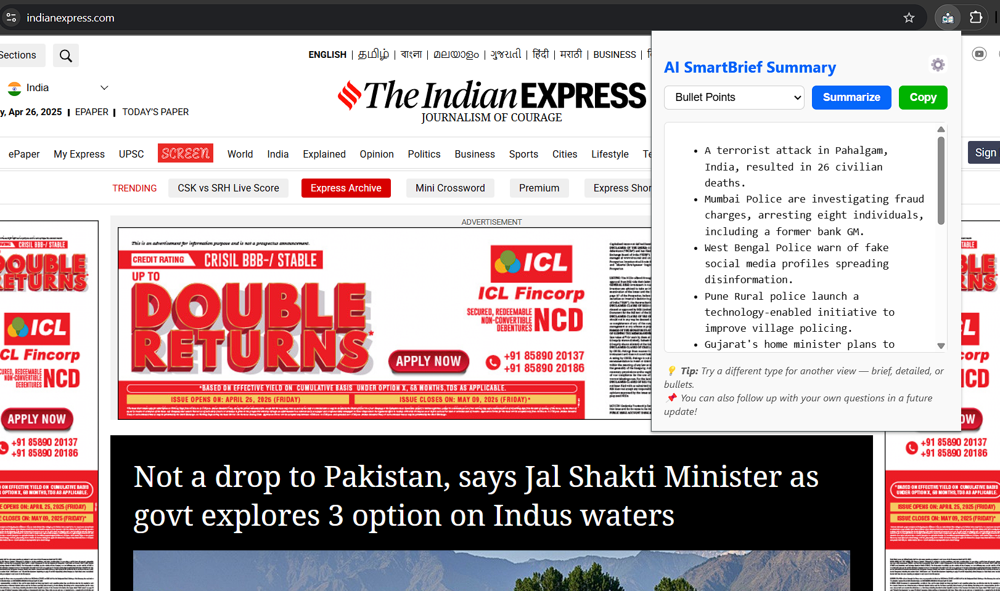
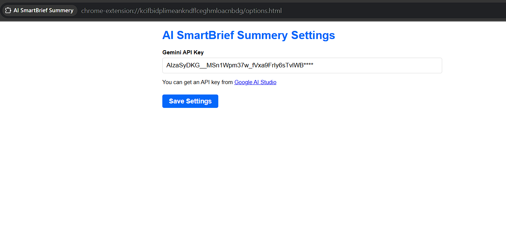

# ⚙️ AI SmartBrief Summary – AI-Powered News Summarizer Extension

**AI SmartBrief Summary** is a lightweight and powerful browser extension that uses **Gemini AI** to summarize news articles and blog content in real-time. Available on **Chrome** and **Microsoft Edge**, it simplifies long reads into short, digestible summaries – bullet points, briefs, or key insights.

---

## 🚀 Features

- 🧠 Summarize web content instantly using **Gemini AI**
- 📄 Multiple summary formats – brief, bullets, and key takeaways
- 🌐 Works on both **Chrome** and **Edge** browsers
- ⚙️ Simple UI powered by **CSS**
- 🔒 Privacy-safe – runs locally, only sends text to Gemini API

---

## 📦 Tech Stack

- **JavaScript** (Vanilla)
- **Manifest v3** (Chrome Extensions)
- **CSS**
- **Gemini AI API**
- **REST API Integration**

---

## 📸 Screenshots

| Popup Summary UI | API KEY Settings |
|----------|----------------|
|  |  |

---

## 🛠️ Installation (Local)

1. Clone this repo:
   ```bash
   git clone https://github.com/mahaboob-basha-a/smart-brief.git
2. Go to `chrome://extensions` or `edge://extensions`
3. Enable **Developer Mode**
4. Click **"Load unpacked"**
5. Select the project folder

---

## 🧠 How It Works

- When the user clicks the **AI SmartBrief** icon, the extension grabs the main article content.
- Sends it to **Gemini AI API** via a custom prompt.
- Receives and displays a summarized version in the popup UI.

---

## 🔐 Permissions

- `activeTab` – to access current webpage content  
- `scripting` – to extract readable content from the page
- `storage` – to store API key

---

## 📄 Privacy Policy

AI SmartBrief does **not** store or track any user data.  
It only sends necessary text to Gemini API for summarization and returns the result for local display.

## 📥 Download

- 🧩 **Chrome Web Store** (Coming Soon)  
- 🧩 **Edge Add-ons Store** (Coming Soon)

---

## ✨ Coming Soon

- ✅ History of recent summaries    
- ✅ Dark mode toggle  

---

## 📬 Contact

Made with ❤️ by **Mahaboob Basha**  
📩 Email: alurumahaboobbasha@gmail.com
